这份讲义旨在为开发者提供 **Claude Code** 进阶能力的深度指南。从基础的 Skill 扩展到复杂的多 Agent 协作框架，涵盖了从个人效率到团队生产力的全路径。

-----

# 终端超级大脑 Claude Code (中) —— 命令行里的 Agent 智能体

## 课程简介

在掌握了 Claude Code 的基础交互后，本阶段将深入探讨如何通过 **Skill**、**MCP** 以及 **多 Agent 框架** 将其从一个“对话式编程助手”升级为能够自主处理复杂工程任务的“终端智能体”。

-----

## 一、 扩展能力：Skill 与 MCP

### 1\. Skill 简介
Anthropic 官方在 2025 年 10 月 16 日正式发布了 Claude Skills 功能，Skills 从此横空出世。截止到2026年4月社区贡献突破上万个skill。

**Skill**是可复用的说明、知识、工作流，通常包含一个 SKILL.md 以及可运行脚本、资源文件。

### 2\. SkillHub 资源网站

  * **Vercel Lab 出品的 skill 排行榜**:[Vercel Lab 出品的 skill 排行榜](https://skills.sh/)
  * **Anthropic 官方 Skills 仓库**: [Anthropic 官方 Skills 仓库](https://github.com/anthropics/skills)。

### 3\. 常用 Skill 推荐

•查找skill的 skill：
```
npx skills add https://github.com/vercel-labs/skills --skill find-skills
```
•创建 skill 的 skill
```
npx skills add https://github.com/anthropics/skills --skill skill-creator
```
• 产品需求头脑风暴规划
```
npx skills add https://github.com/obra/superpowers --skill brainstorming
```
• 前端开发 React 编码规范 skill
```
npx skills add https://github.com/vercel-labs/agent-skills --skill vercel-react-best-practices
```

• 前端开发 UI/UX 美化
```
npx skills add https://github.com/nextlevelbuilder/ui-ux-pro-max-skill --skill ui-ux-pro-max
```
• 浏览器自动化 skill
```
npx skills add https://github.com/vercel-labs/agent-browser --skill agent-browser
```

### 4\. 安装 Skill 教程与实战

  * **安装命令**: 通常使用 `npx skills add <skill-name>` 安装
  示范命令安装
```
npx skills add https://github.com/vercel-labs/skills --skill find-skills
```
选择安装到claude code
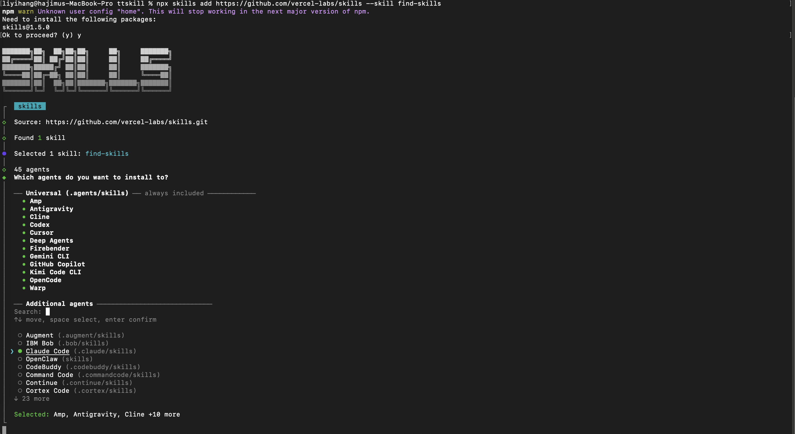

选择安装到全局
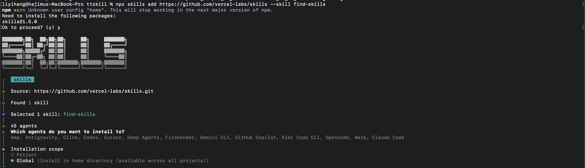

使用链接的方式安装


预览安装路径和风险
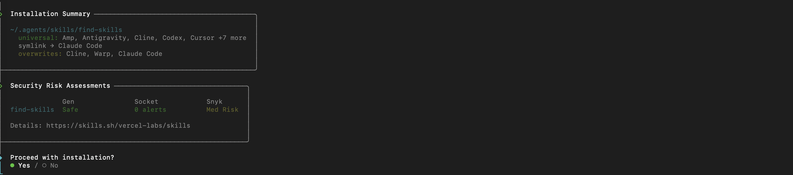

安装完成
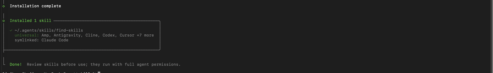

  * 或下载skill文件夹，手动放置在全局skills目录 `~/.claude/skills` 目录 或者 项目的skills目录`./.claude/skills`。
  * **实战**: 尝试编写一个简单的 `weather-skill`，让 Claude 能在终端告诉你当前城市的天气。

使用模板创建skill实战
```
npx skills add https://github.com/anthropics/skills --skill skill-creator
```

```
claude
```

```
帮我创建一个weather-skill，可以查询中国城市的当前天气
```
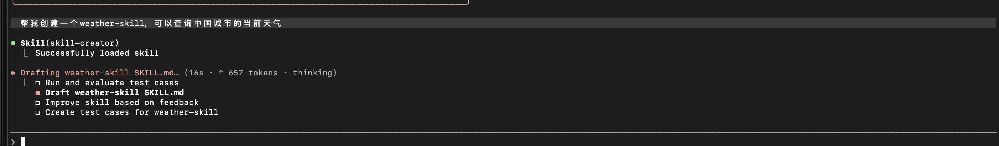

创建成功
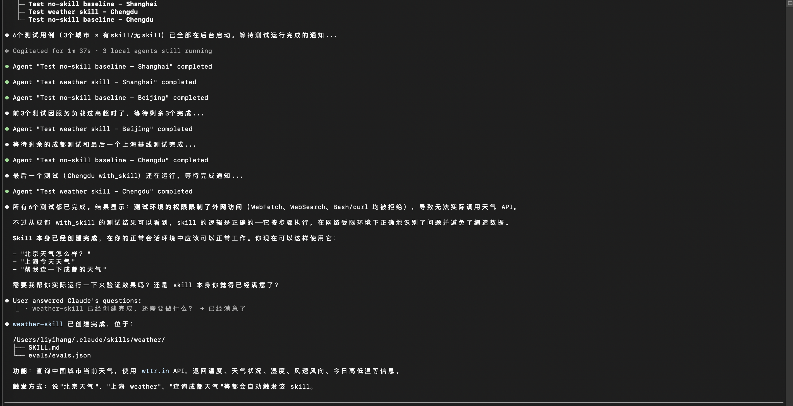

开始测试
```
深圳天气
```
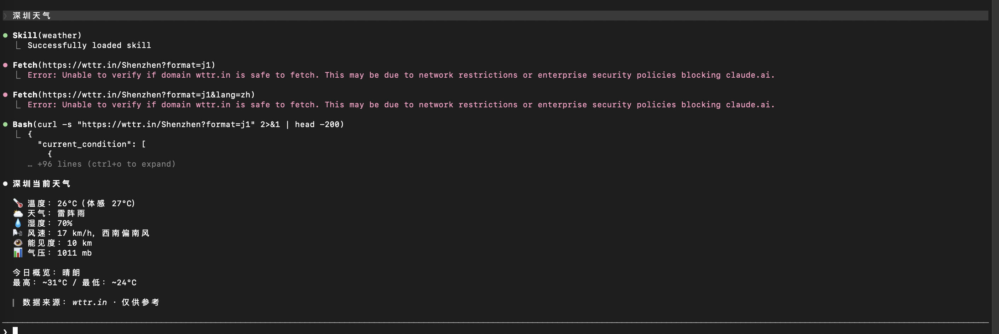
-----

## 二、 协议标准：MCP (Model Context Protocol)

### 5\. MCP 简介

MCP 全称：Model Context Protocol（模型上下文协议）
它是 Anthropic（Claude 的开发公司）在 2024 年底推出的开放标准协议，被誉为 “AI 世界的 USB-C 接口” 或 “AI 的标准化工具连接层”。
简单一句话理解
MCP 让 Claude（尤其是 Claude Code / Claude Desktop） 能够安全、标准化地连接外部工具、数据库、API、浏览器、GitHub、Jira、Slack 等系统，突破了原来只能在聊天框里“看你粘贴什么就处理什么”的限制。

### 6\. MCPHub 资源网站
  * **mcpso**: [mcpso](https://mcp.so/)
  * **smithery**  [smithery](https://smithery.ai/) 
  * **pulsemcp** [pulsemcp](https://www.pulsemcp.com/)

-----

## 三、 命令与钩子：控制权的精细化

### 7\. 斜杠命令 (Command) 简介
Command（命令）是一种确定性的、由人类或系统主动发起的指令（例如Claude code 里的 /help ）。
触发关系：Command 是唤醒 Skills 的一种最直接的方式。当你输入一条 Command 时，系统不需要经过复杂的思考（不需要 Agent），直接去执行对应的 Skills。

  * `/compact`: 压缩上下文，保留关键信息。
  * `/review`: 对当前暂存区的代码进行评审。

### 8\. Hook 简介
Hook（钩子） 是一种事件监听机制。它允许系统在特定的“事件”发生时，自动拦截并执行一段代码（例如 Webhook、Git pre-commit hook）。
联动关系：如果说 Command 是“人主动去按开关”，那么 Hook 就是“系统自动感应”。Hook 本身不处理复杂业务，它的核心作用是在特定时机触发一个 skill。

  * **Pre-commit Hook**: 在你 Git commit 之前，让 Claude 检查是否存在潜在的 Security Issue。

-----

## 四、 进阶：多 Agent 协作

### 9\. Agent 简介

这里的 Agent 指的是具有特定角色、上下文和工具集的 Claude 实例。打开一个claude窗口就是一个主Agent

### 10\. Agent worktree 非直接业务多窗口任务

通过 `--worktree` 参数实现并行开发：

  * **窗口 A (开发)**: 执行主逻辑编写。
  * **窗口 B (功能1开发)**: 执行 `claude --worktree feature-dark-mode` 在另一个分支或目录执行暗黑UI切换。
  * **窗口 C (功能2开发)**: 执行 `claude --worktree feature-filter` 在另一个分支或目录执行过滤功能开发。
```
mkdir tt-todolist-worktree
cd tt-todolist-worktree
git init
```

演示实操：
##### 主agent
```
claude
```

```
建一个简单好用的「个人待办事项清单」（Todo List）网页，能添加任务、标记完成、删除任务。
```
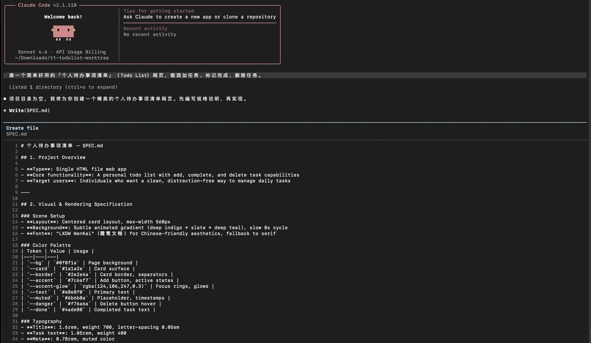

等等应用初稿完成
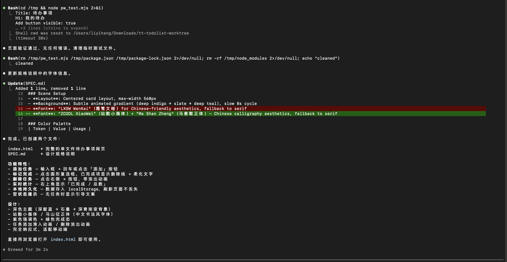
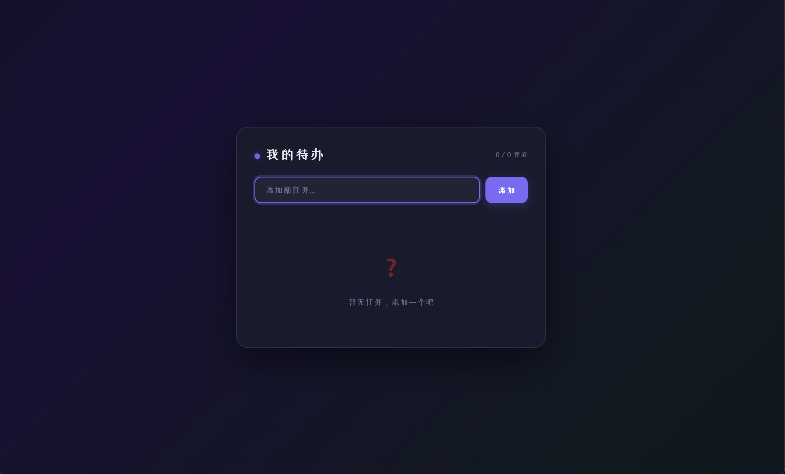


输入
```
使用git 提交一个记录
```
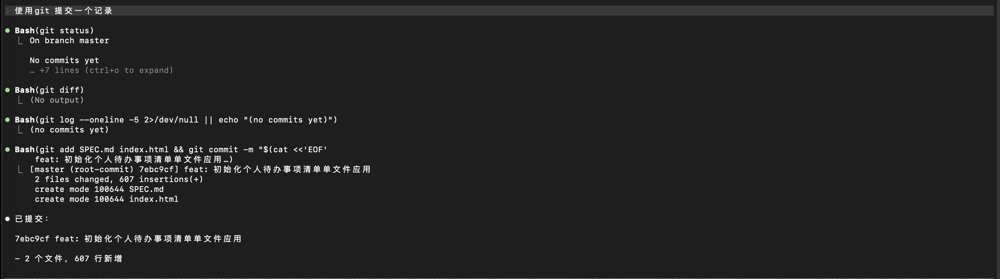


##### 同时打开 ui背景切换 worktree，并执行任务
```
claude --worktree feature-dark-mode
```
输入
```
增加右上角按钮，实现深色模式切换
```
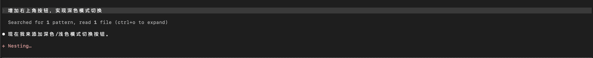


深色模式，任务完成
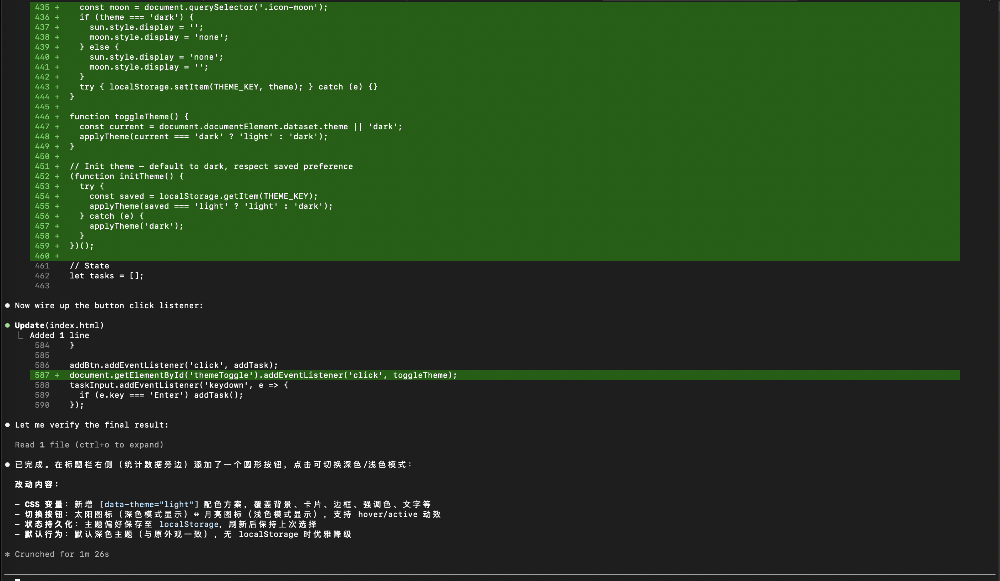


```
合并到master分支
```

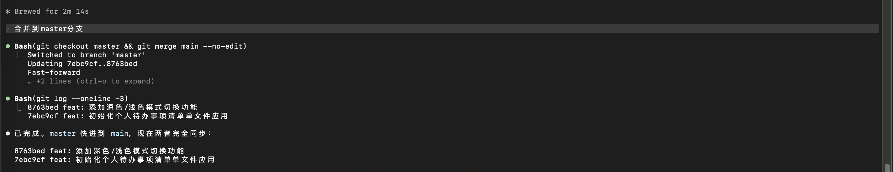

##### 同时打开任务完成情况过滤 worktree，并执行任务
```
claude --worktree feature-filter
```

输入
```
增加 任务过滤（全部/未完成/已完成）功能
```

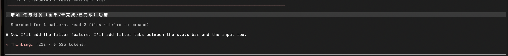

过滤功能完成
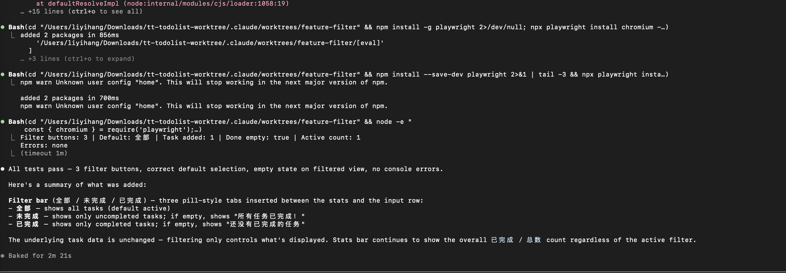

```
合并到master分支
```
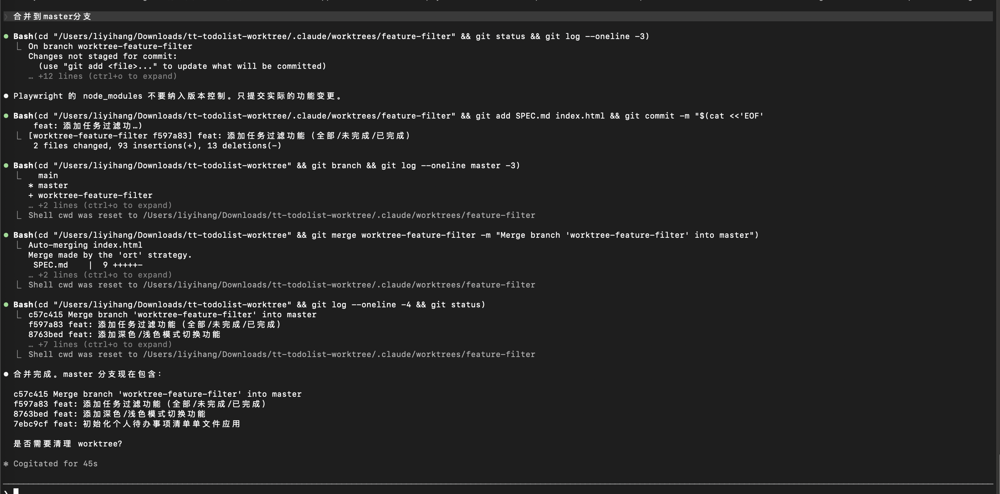


合并后的最终版本
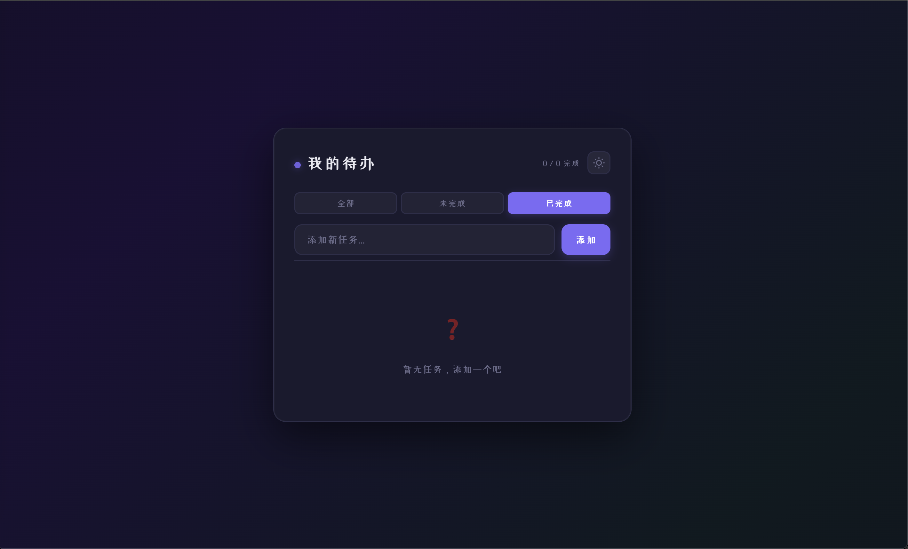

### 11\. Agent Teams
Claude Agent Teams（也称 Claude Code Agent Teams）是 Anthropic 在 2026 年 2 月 5 日 随 Claude Opus 4.6 模型发布的一项实验性（research preview）功能。
Agent Teams 把“一个 Claude 慢慢干”变成了“一个团队的 Claude 同时干”，特别适合需要并行探索、审查或实现多个独立特性的复杂开发任务，而且这些agent可以协作通信。

#### Agent Team 演示（简化版 - 适合非技术观众）

我们让 Claude 同时调动 **3 个 AI 智能体** 像一个小团队一样协作，共同完成一个任务：

**演示任务**：  
创建一个简单好用的「个人待办事项清单」（Todo List）网页，能添加任务、标记完成、删除任务。

**参与的 3 个 AI 智能体**：
- **Coordinator（协调员）**：像项目经理一样，制定计划、分配工作、把大家成果拼在一起。
- **Frontend Developer（界面开发员）**：专门负责做出漂亮且好操作的网页界面。
- **Tester（测试员）**：像质检员一样，认真测试所有功能是否正常，找出 bug 并要求修复。

**演示看点**：
- 看到 3 个 AI 如何分工合作（而不是一个人全包）。
- 它们会互相沟通、分享信息。
- 最终快速产出一个能正常使用的网页。

这个过程能直观展示 **Agent Team** 如何让 AI 工作更高效、更有质量。

```
mkdir tt-todolist
cd tt-todolist 
```

启动带agentteam功能的claude
```
export CLAUDE_CODE_EXPERIMENTAL_AGENT_TEAMS=1
claude
```


输入
```
创建一个美观简洁的"个人待办事项列表"网页，让用户可以：
1 添加新任务
2 标记任务为已完成
3 删除任务

组建一个恰好包含以下3个角色的代理团队：
1 协调员：担任团队领导。创建清晰的计划，将任务分配给其他成员，协调他们之间的工作，并将所有内容整合成一个最终可工作的页面。
2 前端开发人员：构建用户界面（HTML + CSS + JavaScript）——使其简洁、现代且易于使用。
3 测试员：全面测试所有功能，发现任何问题或边界情况（如空列表、长任务名称），并提出或实施修复。

允许代理在需要时相互沟通。
所有工作完成后，展示最终可工作的页面，并总结每个代理的贡献。
首先创建代理团队并展示初始计划。
```
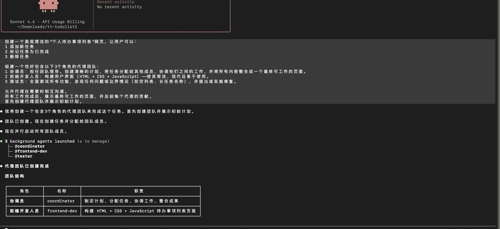


在执行过程中，可以按左右箭头切换agent，然后按回车查看当前agent的执行日志
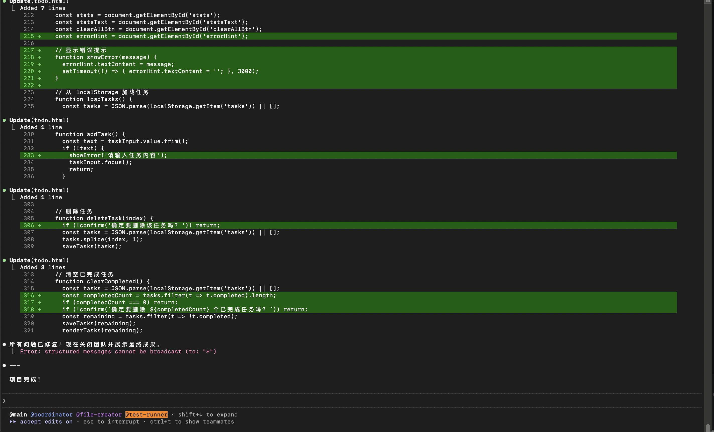

任务执行完成，关闭所有agent
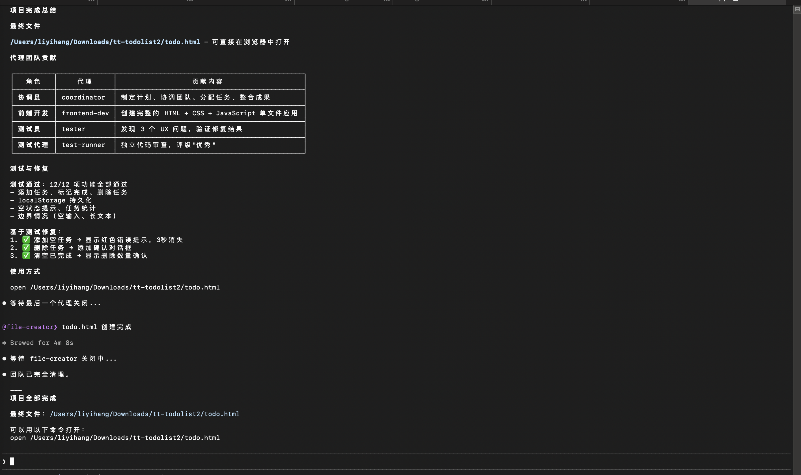


更直观的同时观看所有agent的日志，可以安装tmux分屏软件，这里就不继续深入讨论了
-----

## 五、 插件与框架对比

### 12\. Plugins 插件简介
2025 年 10 月 9-10 日：正式公测（public beta）发布。
Anthropic 宣布推出 Claude Code Plugins 系统，支持通过单一命令安装和分享自定义扩展（slash commands、agents、hooks、MCP 等）。这是 Claude Code 从“单一代理”向高度可扩展工具转型的重要一步。

官方插件列表： https://claude.com/plugins#plugins
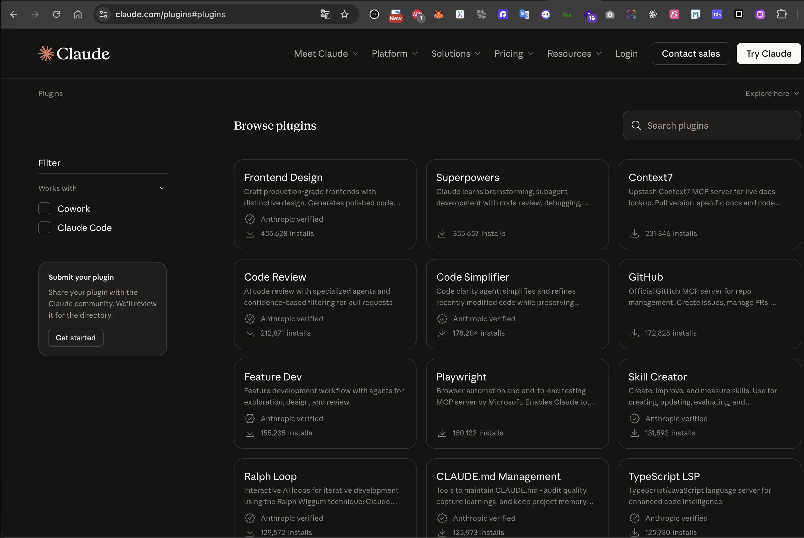

  * **典型代表**: **Superpowers**(https://github.com/obra/superpowers)。Superpowers是一个为Claude Code设计的开源插件框架，它通过强制AI遵循严格的软件开发方法论，将AI编程助手从简单的"代码生成器"转变为懂得先设计再编码、会写测试、能自我审查的工程助手。

### 13\. 高星多 Agent 框架对比

以下是您提供的CSV表格转换为Markdown格式：

| 框架 | GitHub Stars（约） | 核心哲学 / 定位 | 多 Agent 方式 | 最佳使用场景 | 安装难度 | 重量级（流程繁重程度） | 社区口碑亮点 / 缺点 |
|------|-------------------|-----------------|---------------|--------------|----------|----------------------|---------------------|
| Superpowers | 13.6k | 严谨工程纪律 + TDD + 结构化流程 | Sub-agent + 技能组合 + 对抗式审查 | 需要高质量代码、TDD、长期维护的项目 | 低（官方插件市场） | 中等–高 | 最成熟、增长最快；适合 solo 开发者补纪律。缺点：有时过于严格 |
| GStack (gstack) | 10.5k | 角色治理 + 虚拟团队视角（Garry Tan） | 23 个 Specialist Roles（CEO、Designer、QA、Security 等） | 产品规划、架构评审、团队标准化 | 低（skills） | 中等 | YC CEO 作品，决策层强；适合 startup 思维。缺点：部分技能偏产品而非纯工程 |
| Get Shit Done (GSD) | 54.2k | 轻量上下文工程 + 反"企业仪式" | Wave parallelism + 原子任务 + 上下文隔离 | Solo 快速交付、已知明确需求 | 低（npx） | 低 | 最轻快、不拖沓；适合不想繁琐流程的人。缺点：对复杂文档驱动项目较弱 |
| BMAD | 44.9k | 多角色敏捷团队模拟 + 完整文档流 | 12+ 固定 Agent（PM、Architect、Dev、UX 等） | 复杂项目、需 PRD/Architecture 的团队 | 中等 | 高 | 文档最完整、企业感强；缺点：被吐槽 bloated（流程重、token 消耗大） |
| SpecKit (GitHub 官方) | 7.6k | Spec-Driven（规范先行） + Agent-agnostic | 无固定 Agent（跨工具标准化） | 合规、跨 Agent、大组织、spec 重项目 | 中等（CLI，支持 air-gapped） | 中等 | 企业友好度最高（有企业安装指南）；缺点：有时显得"生成幻觉工作" |
| everything-claude-code | 24.8k | 生产级 + 可审计 + 大量 skills | 28+ Agent + 116+ skills | 生产系统、安全、可审计的大型项目 | 中等 | 高 | Skills 最丰富；适合重度用户。缺点：可能过于全面而复杂 |
| Compound Engineering (CE) | 1.1k | 复利式工程（Plan 80% + Review + 知识积累） | 多 Agent + git worktrees 并行 | 长期可持续开发、知识复用 | 低（插件） | 中等 | 强调"每次工作让后续更容易"；适合想建立长期系统的人。Every Inc. 重度自用 |
| OpenSpec | 2.8k | 轻量 Spec-Driven + Delta Specs | 轻量 CLI 驱动 | Brownfield（现有代码）快速迭代 | 低 | 低 | 比 SpecKit 更快更轻；适合已有项目增量修改 |

这个Markdown表格保留了您原始数据中的所有信息，包括范围值、括号内的补充说明以及优缺点描述。

> **总结推荐：**
>
>   * **个人**: 推荐 **Superpowers**，上手快，功能覆盖全。
>   * **小团队**: 推荐 **GStack** 或 **SpecKit**，兼顾效率与规范。
>   * **大团队**: 推荐 **BMAD**，适合处理复杂业务逻辑与合规性要求。

-----

## 六、 实战演练

### 14\. 个人框架 Superpowers 实战，
superpower简介(https://github.com/obra/superpowers)
Superpowers 是 Claude Code 插件市场上最流行的 Agentic Coding 框架之一，目前在 GitHub 上已有 156k ⭐！

Superpowers 是一个开源的 AI 行为准则框架。它不是直接帮你写代码，而是给 AI 制定了一套极其严格的“工作流程”和“专业技能”，让 AI 像一个有多年经验、做事极度严谨的顶级工程师一样思考和行动。主要技能包括：
✅ 需求脑暴
✅ 编写计划
✅ 执行子代理
✅ 测试驱动开发
✅ 代码质量检查

最好的是：我们不需要手动去点这些功能，只要安装好后，AI 就会在后台自动调用这些技能，你只需要像往常一样跟它聊天提需求即可！


我们做一个疫苗记录单网页应用
##### 1. 创建项目目录
```
mkdir claude-yimiao
cd claude-yimiao
```

进入claude
```
claude
```
##### 2. 安装 Superpowers 插件。

```
/plugin marketplace add anthropics/claude-plugins-official
```
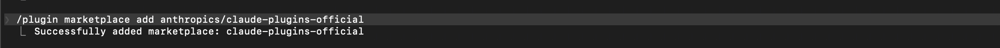

```
/plugin install superpowers@claude-plugins-official
```
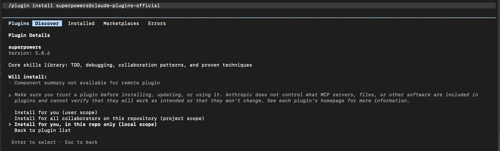

这里我们是测试目的，选第三个“Install for you, in this repo only (local scope)  ”

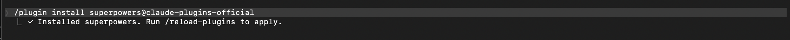


这三个选项是 **Claude Code**（包括安装 Superpowers skills 或插件时）提供的**安装范围（scope）**选择，主要区别在于**谁能使用**、**配置存储位置**以及**是否随仓库共享**。

以下是清晰对比（以 `npx skills add` 或类似安装流程为例）：

| 选项 | 英文名称          | 含义（谁能用）                          | 配置存储位置                          | 是否提交到 Git（共享） | 推荐场景 |
|------|-------------------|-----------------------------------------|---------------------------------------|------------------------|----------|
| **第一个** | Install for you (user scope) | **只你自己**，**所有项目** 都能用     | `~/.claude/skills/` 或用户全局设置文件（如 `~/.claude/settings.json`） | 否（个人私有） | **最常用推荐**<br>你个人经常使用的 skills（如 Superpowers 核心技能），想在所有仓库里都可用 |
| **第二个** | Install for all collaborators on this repository (project scope) | **团队所有人**（仓库协作者）都能用   | 项目根目录下的 `.claude/skills/` 或 `.claude/settings.json` 等 | 是（建议 commit 到仓库） | 团队协作项目<br>希望整个团队都统一使用同一套 Superpowers skills 或工作流 |
| **第三个** | Install for you, in this repo only (local scope) | **只你自己**，**仅当前仓库** 生效    | 项目内本地文件（如 `.claude/skills.local/` 或 gitignored 的本地配置） | 否（通常加到 `.gitignore`） | 测试新 skill、敏感配置、或只想在当前项目实验时使用<br>不会影响其他项目 |


##### 3 刷新插件
```
 /reload-plugins  
``` 
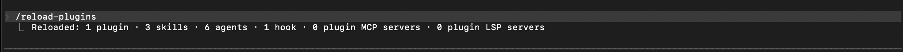

##### 4 查看安装的插件
```
/plugin  
```
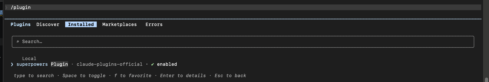


查看新增的技能

```
/skills
```
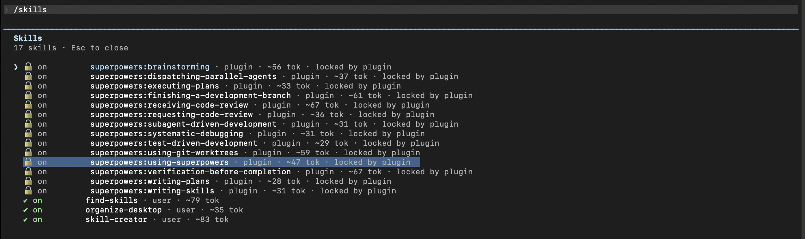

##### 3 初始化项目
```
/init
```
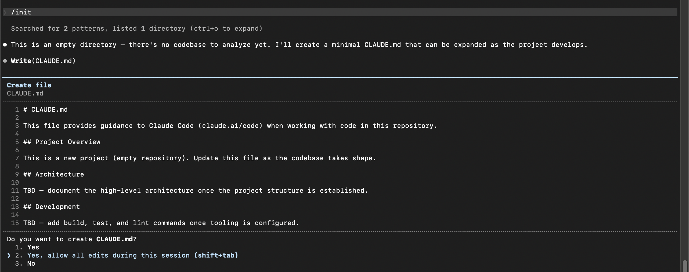

##### 4 演示如何通过从”需求分析”到”代码实现”的全过程。

输入我们的需求，他会调用superpowers的brainstorming技能，对话式的帮我们拆解需求

```
我想做一个宝宝疫苗记录单网页工具，
1 可以初始化出生年月日配置宝宝信息，然后提醒7天内可以打的疫苗。
2 可以输入打的疫苗和接种日期，用于存档
```
发送过去我们看到他开始调用技能了
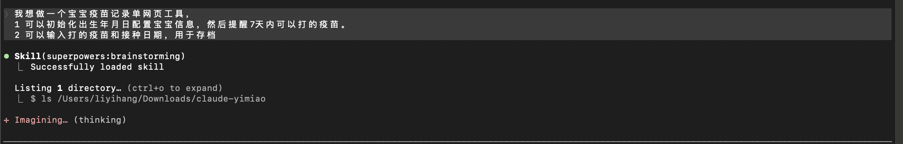

先问了疫苗提醒是免费还是付费的，我们选1
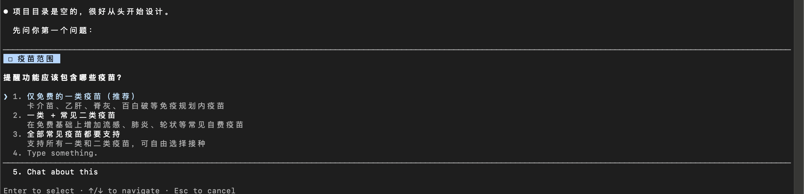

然后问了数据存储方式，选1
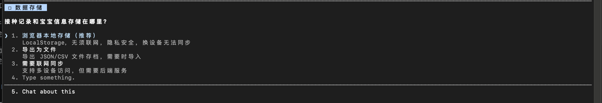

然后问了界面风格，选1
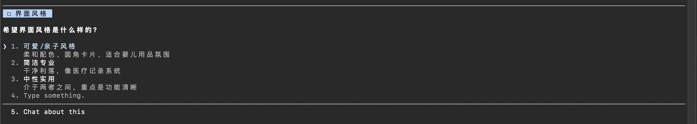

然后问支持几个宝宝，选1
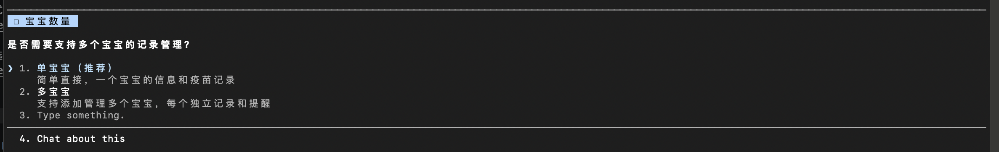

然后问核心设计，选满意吧
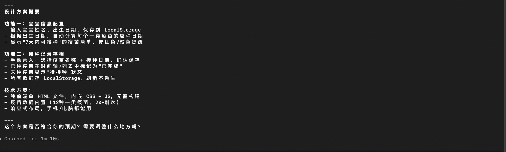

然后他帮我们创建spec文档
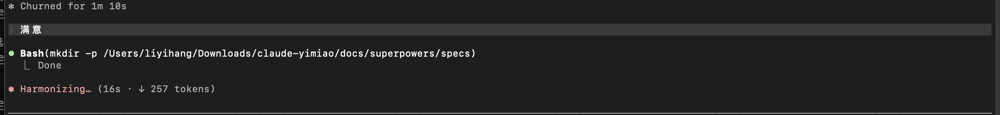


创建好之后，进入计划阶段，创建执行计划
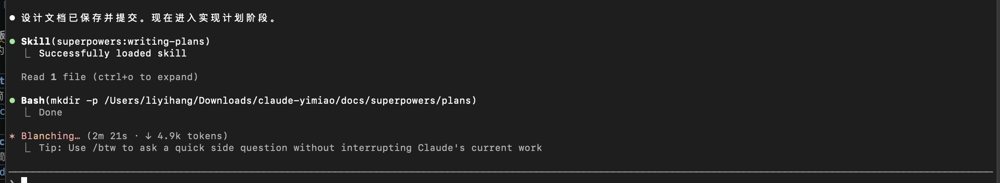

这里做好了计划，我们选2，一次处理完，然后在设置检查点
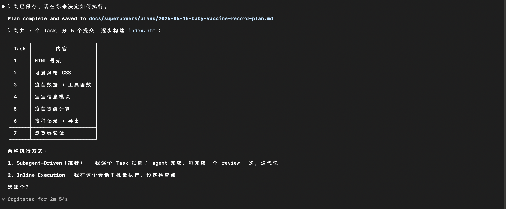

这里开始执行计划
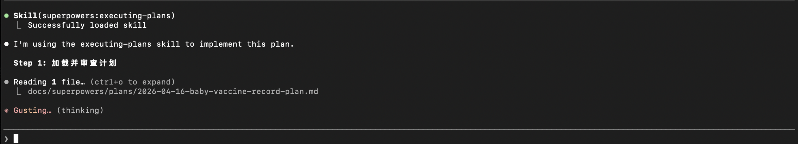

经过漫长的等待，计划执行完成，代码也编写好了
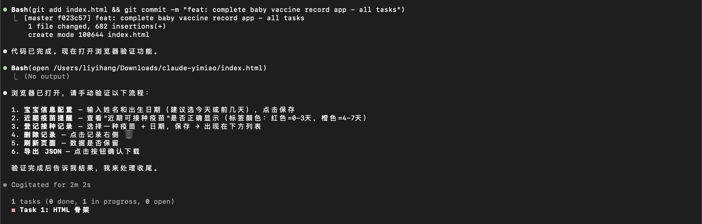

他帮我们自动打开应用网页，试用了一下功能，感觉还行，流程比较丝滑
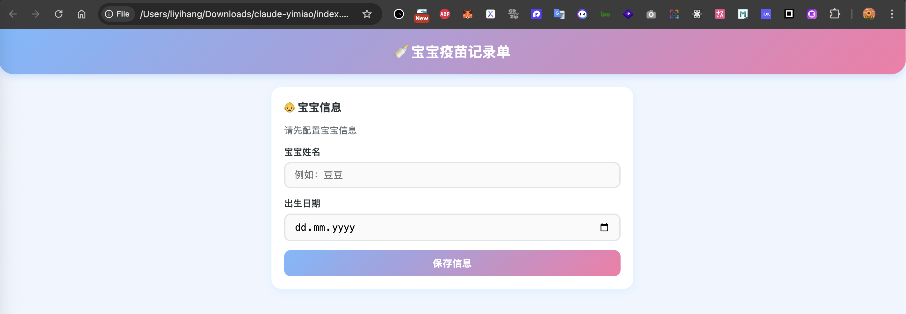

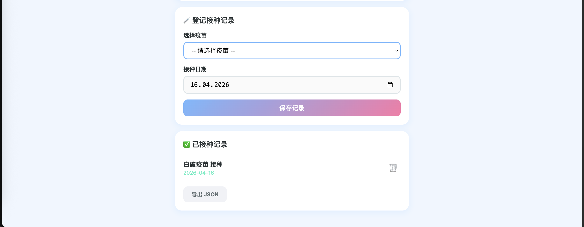


验证完功能后，开始收尾工作，我们演示用就先选1
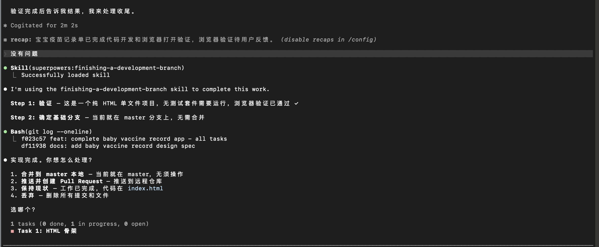

### 15\. 团队框架 BMAD 实战

BMAD简介(https://github.com/bmad-code-org/BMAD-METHOD)
BMAD 是一个开源的 AI 多agent敏捷开发框架，专门为 Claude Code、Cursor 等 AI 编码环境设计。它把 Claude（或其他大模型）从“氛围编程”（vibe coding）转变为一个结构化、多角色 AI 团队，让 AI 成为你的专业协作伙伴，而不是简单执行工具。

目前一个简化版完整演示流程如下
1. **`/bmad-product-brief`**  
   - 从模糊想法快速生成产品简报，定义核心价值和 MVP 范围。
2. **`/bmad-create-prd`**  
   - 让 PM Agent 把 Product Brief 转化为完整 PRD（包含用户故事、验收标准等）。
3. **`/bmad-create-architecture`**  
   - Architect Agent 根据 PRD 输出技术架构和实现规格。
4. **`/bmad-create-epics-and-stories`** （或直接 `/bmad-create-story`）  
   - 拆解需求为可执行的用户故事。
5. **`/bmad-quick-dev`** （推荐演示） 或 `/bmad-dev-story`  
   - 快速实现第一个用户故事，展示 TDD/实现流程（quick-dev 更适合演示，速度快）。
6. **`/bmad-code-review`**  
   - 执行对抗式代码审查，展示质量控制。

##### 

##### 创建演示项目
```
mkdir claude-bmad-richeng
cd claude-bmad-richeng
```


##### 2. 安装 bmad 插件。

```
npx bmad-method install --directory /Users/liyihang/Downloads/claude-bmad-richeng --modules bmm --tools claude-code --yes
```
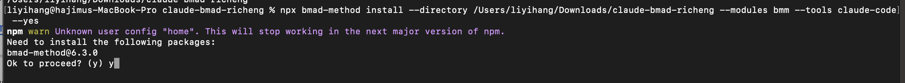
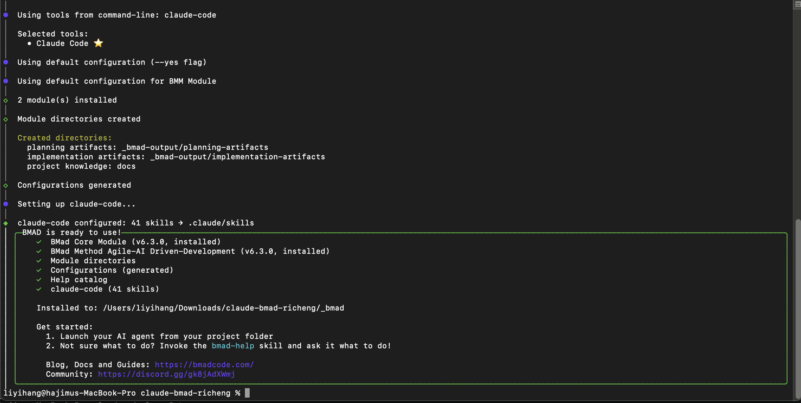


进入claude
```
claude
```

初始化
```
/init
```

查看bmad的skills
```
/skills
```
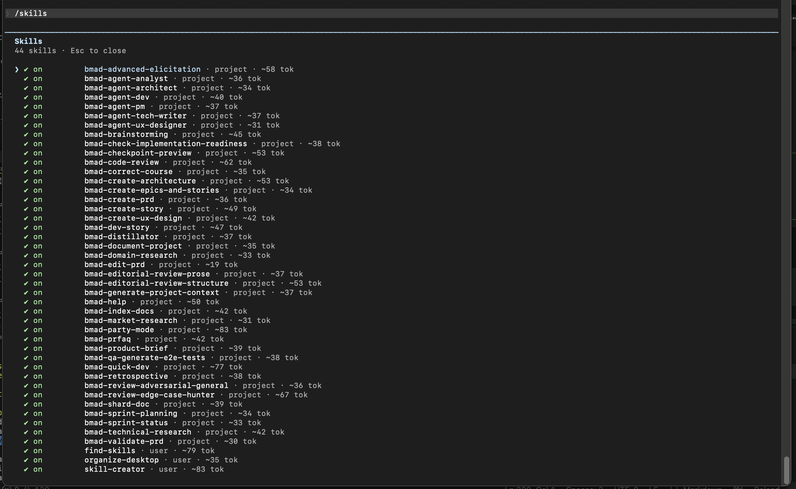


交互开始确定需求
```
/bmad-product-brief
```
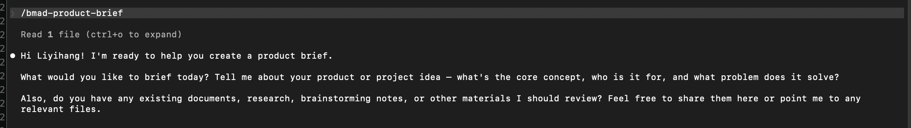


输入
“我想做一个日程管理单页网页应用，包含日历日期选择，新建日程。可以查看每月的日程列表”


我们回答上面的问题,输入
```
1 自己用的
2 个人时间管理和规划
3 没有
4 html/css/js
5 本地存储
6 从零开始
```


继续回答上面问题，输入
```
1 日程支持全天
2 先做创建和查看
3 显示公历
4 商务蓝色

```
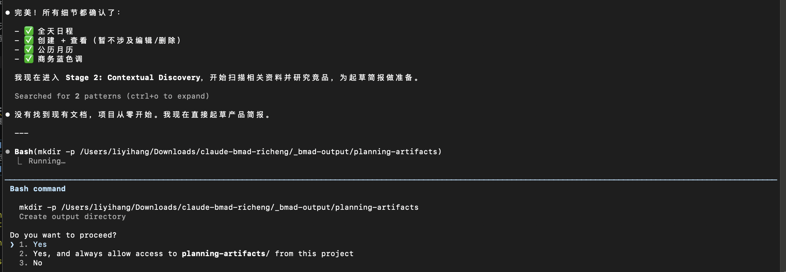

产品简报完成了
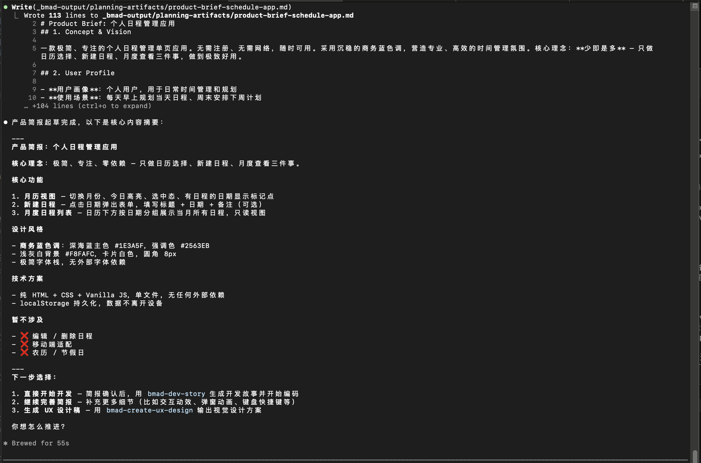


我们开发流程正式一点，让他生成prd吧
```
/bmad-create-prd
```

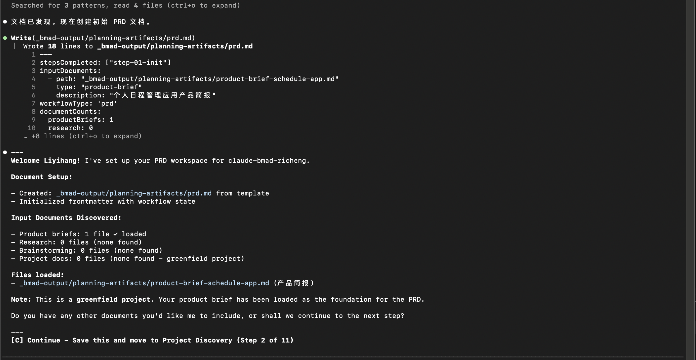

我们继续，输入
“c”


这里提示要深入理解需求，还是头脑风暴，还是继续构建产品愿景，我们选第三个c


然后他让我们思考产品的愿景相关问题，

输入

```
1 简洁专业
2 看到日程表那一刻
3 更符合个人习惯的，离线的
4 一个离线简介的日程管理软件
```

下面的十多步 prd步骤先略过了贴图


完整的13个prd步骤为
```
/bmad-create-prd 常见的 13 步完整流程（实际步骤文件名和顺序可能因版本略有调整）：

1 step-01-init
初始化 workflow，加载项目上下文，检查已有文档（Product Brief 等）。

2 step-02-discovery
项目发现与上下文深度收集（背景、问题域、利益相关者等）。

3 step-02b-vision
定义产品愿景（Vision）和使命。

4 step-02c-executive-summary
生成执行摘要（给高层看的概述）。

5 step-03-success（或 step-03-success-metrics / step-05-metrics）
定义成功标准、KPI 和度量指标。

6 step-04-journeys
绘制用户旅程（User Journeys）和核心场景。

7 step-05-domain-analysis（或 step-05-technical / step-05-domain）
领域分析、关键实体、业务规则、技术趋势等。

8 step-06-innovation（或 step-06-features / step-06-innovation）
功能 brainstorm、创新点、差异化特性。

9 step-07-project-type / step-07-scoping
项目类型判断 + 范围划定（MVP vs 后续阶段）。

10 step-08-requirements（或 step-08-fr-nfr）
功能需求（FRs）和非功能需求（NFRs）详细定义。

11 step-09-stories（或 step-09-epics-stories）
拆解成 Epics 和 User Stories。

12 step-10-acceptance（或 step-10-criteria）
验收标准（Acceptance Criteria）细化。

13 step-11-review / step-12-complete / step-v-13-report-complete
最终审查、完整性检查、输出 PRD.md，并给出下一步建议（通常是 Architecture 或 Epics & Stories）。
```


#### prd创建好了，我们来设计技术架构
```
/bmad-create-architecture
```


我们继续分析


下面是多个对话进行技术分析，我们可以略过不贴图了，一直继续就可以了。


技术架构设计好了，我们继续下一步

#### 创建史诗和用户故事
```
/bmad-create-epics-and-stories
```


我们输入c继续


好了，我们继续略过用户故事讨论环节的贴图

用户故事创建好了，我们继续开发


#### 细化用户故事并开发用户故事
```
 /bmad-create-story 
```


好了，开发完了


我们试用一下，运行成功，感觉功能实现和UI还行


#### 最后审查一下代码
```
/bmad-code-review
```


我们选择Full file review


review完了，有些小问题


我们输入“Batch-apply all”自动修复


#### 总结
1 感觉流程比较繁琐，不熟悉工作流和skill，有时不知道要调用哪个，我们可以调用/bmad-help，看看当前适合调用哪个工作流
2 框架提供的工作流和skill，业务看起来比较专业
3 大家可以自己搭配skill和工作流，找到合适自己的工作流

### **方案A：简化版完整流程（推荐）**
如果想展示从零开始的完整流程但不过于复杂：

1. **`/bmad-product-brief`**  
   - 从模糊想法快速生成产品简报，定义核心价值和 MVP 范围。
2. **`/bmad-create-prd`**  
   - 让 PM Agent 把 Product Brief 转化为完整 PRD（包含用户故事、验收标准等）。
3. **`/bmad-create-architecture`**  
   - Architect Agent 根据 PRD 输出技术架构和实现规格。
4. **`/bmad-create-epics-and-stories`** （或直接 `/bmad-create-story`）  
   - 拆解需求为可执行的用户故事。
5. **`/bmad-quick-dev`** （推荐演示） 或 `/bmad-dev-story`  
   - 快速实现第一个用户故事，展示 TDD/实现流程（quick-dev 更适合演示，速度快）。
6. **`/bmad-code-review`**  
   - 执行对抗式代码审查，展示质量控制。

**总时长**：覆盖了**需求→规划→技术设计→实现→审查**的完整闭环。

-----

## 七、 课后作业

**目标**: 使用 **Superpowers** 框架完成一个单网页应用（SPA）。
**功能需求**:
1.  **接种提醒**: 根据用户输入的出生日期，给出“适合打和快要打的疫苗”提示。
2.  **疫苗记录**: 填写打的疫苗和接种日期
3.  **UI要求**: 简洁、现代。

> **提示**: 尝试用 `/ask` 让 Claude 帮你设计数据结构，然后用 Superpowers 的自动构建能力生成 HTML/JS/CSS。

-----

本讲义旨在构建你对 Claude Code 进阶生态的认知。通过从单一工具到多 Agent 协作的转变，你将体验到“一个人就是一个技术部”的高效开发模式。
